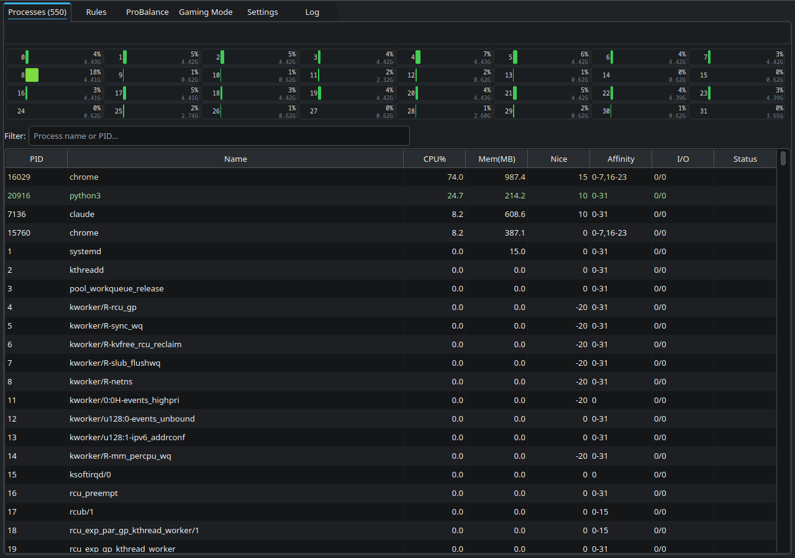
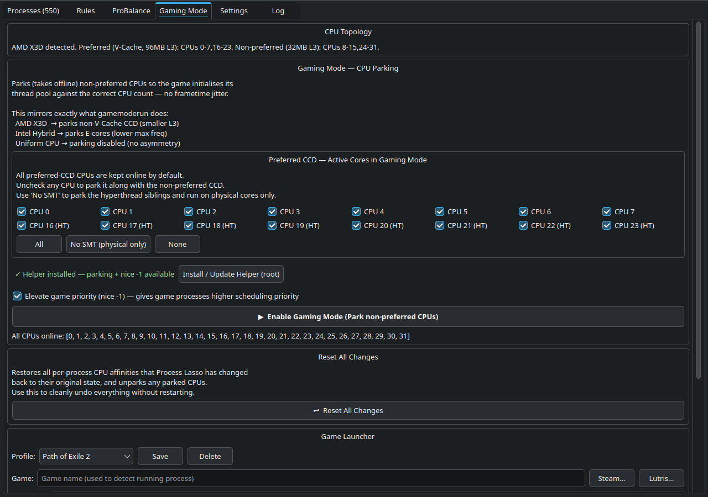
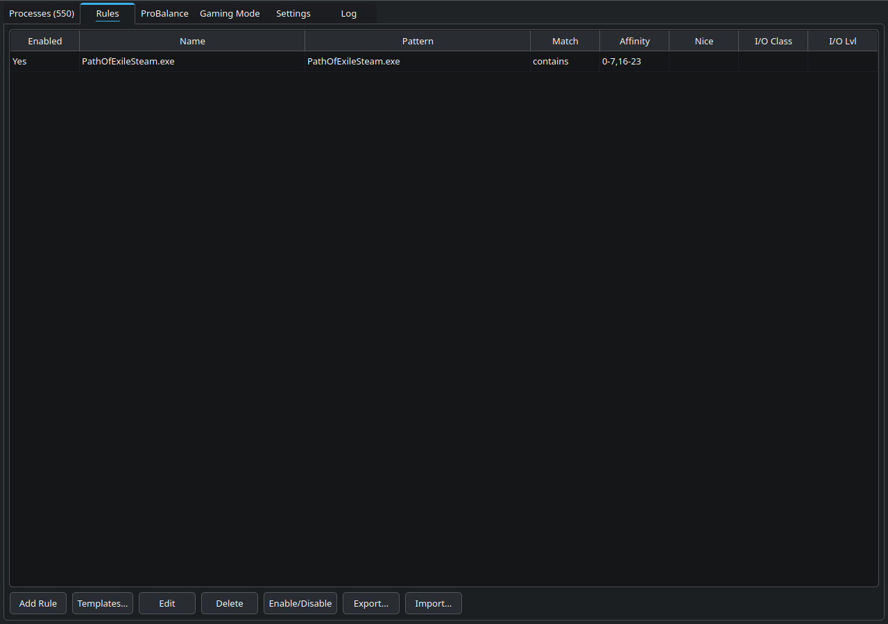
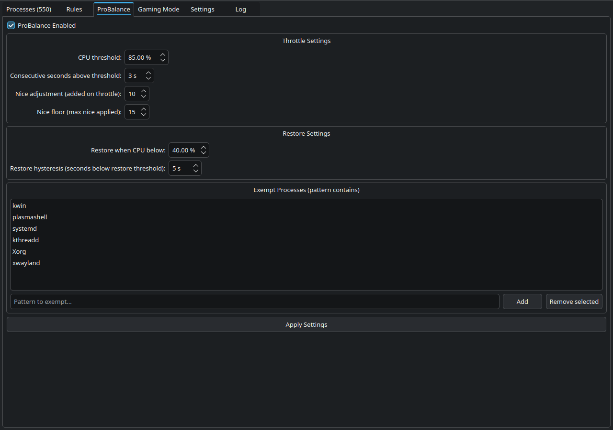
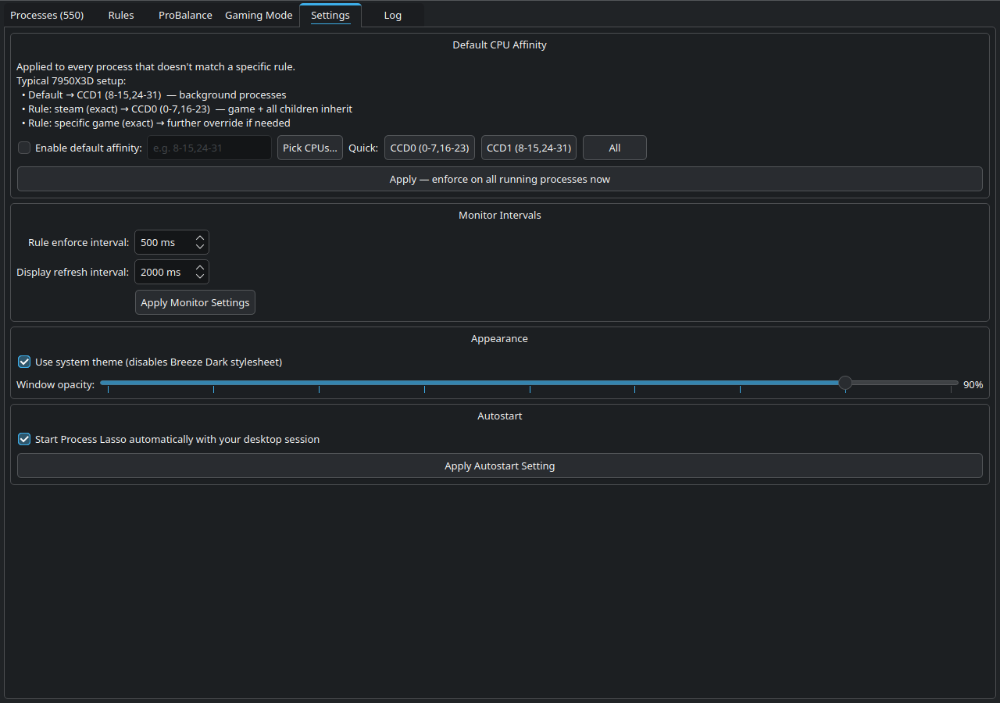

# Process Lasso for Linux — CPU affinity manager with Gaming Mode

## Screenshots

| Processes | Gaming Mode |
|---|---|
|  |  |

| Rules | ProBalance |
|---|---|
|  |  |

| Settings | Log |
|---|---|
|  |  |

## Why it beats Windows Process Lasso on X3D / Hybrid CPUs

Windows Process Lasso uses `SetThreadAffinityMask` to restrict existing threads to a subset of cores. The problem is that threads are already scheduled and thread-pool sizes are already fixed — forcing them onto fewer cores creates scheduling contention and frametime jitter that shows up as stutters in CPU-bound games.

Process Lasso for Linux uses `sysfs` CPU parking (`/sys/devices/system/cpu/cpuN/online`). Writing `0` physically removes non-preferred CPUs from the kernel scheduler before your game ever launches. Every process — including the game, its thread pools, and the OS itself — sees only the preferred cores from the start. Thread-pool sizing is correct, there is no competition for runqueues, and frametime variance drops measurably. This is the same technique used by `gamemoderun` on AMD X3D and Intel Hybrid platforms.

## Features

- **Gaming Mode** — one-click CPU parking for AMD X3D and Intel Hybrid (P-core/E-core) CPUs
- **CPU affinity rules** — pin any process to specific cores by name/regex, persistent across reboots
- **ProBalance** — automatically throttle CPU hogs when system load spikes, restore when calm
- **Per-process nice/ionice** — set I/O and CPU scheduling priorities via right-click context menu
- **Live process table** — sortable by CPU, memory, PID; colour-coded CPU bars (htop-style)
- **System tray integration** — minimize to tray, Gaming Mode indicator
- **Systemd user service** — optional autostart with your graphical session

## Requirements

- Python 3.8+
- `psutil >= 5.9`
- `PyQt6 >= 6.4`
- Linux kernel ≥ 4.1 (sysfs CPU hotplug)
- `sudo` (or a pre-configured NOPASSWD rule) for CPU parking

## Install

```bash
git clone https://github.com/FranzJeger/process-lasso-linux.git
cd process-lasso-linux
bash install.sh
```

The installer detects your package manager and prints the correct install command for any missing dependency.

## Distro compatibility

| Distro | Package manager | psutil | PyQt6 |
|---|---|---|---|
| Arch / Manjaro | pacman | `python-psutil` | `python-pyqt6` |
| Ubuntu / Debian | apt | `python3-psutil` | `python3-pyqt6` |
| Fedora / RHEL | dnf | `python3-psutil` | `python3-PyQt6` |
| openSUSE | zypper | `python3-psutil` | `python3-pyqt6` |
| Any | pip | `psutil` | `PyQt6` |

## Gaming Mode quick-start

### AMD X3D — multi-CCD only

Only applies to CPUs with **two CCDs where one has 3D V-Cache and the other does not**:

| CPU | Cores | 3D V-Cache CCD |
|---|---|---|
| Ryzen 9 7900X3D | 12 | CCD0 (6 cores, large L3) |
| Ryzen 9 7950X3D | 16 | CCD0 (8 cores, large L3) |
| Ryzen 9 9900X3D | 12 | CCD0 (6 cores, large L3) |
| Ryzen 9 9950X3D | 16 | CCD0 (8 cores, large L3) |

Single-CCD X3D chips (5800X3D, 7800X3D, 9800X3D) have all cores on the same die — there is nothing to park and no asymmetry to exploit.

The detector finds the CCD with the larger L3 cache and marks those cores as *preferred*. The plain CCD is parked.

1. Open Process Lasso → **Gaming Mode** tab
2. Click **Enable Gaming Mode**
3. Launch your game — it runs exclusively on the 3D V-Cache CCD
4. Click **Disable Gaming Mode** when done (cores come back online immediately)

### Intel Hybrid (12th gen+, Core Ultra)

The detector identifies P-cores (higher max frequency) as preferred and parks E-cores.

1. Open Process Lasso → **Gaming Mode** tab
2. Click **Enable Gaming Mode**
3. Launch your game — it runs on P-cores only, E-cores handle background tasks
4. Click **Disable Gaming Mode** when done

## Built with AI

This project was built entirely with [Claude](https://claude.ai) (Anthropic). Every line of Python, the GUI, the sysfs integration, the helper binary — all of it was written through a conversation with an AI assistant. No apologies. It works, it's fast, and the purple theme slaps.

If that bothers you, the unpark button is right there.

## License

MIT — see [LICENSE](LICENSE).
