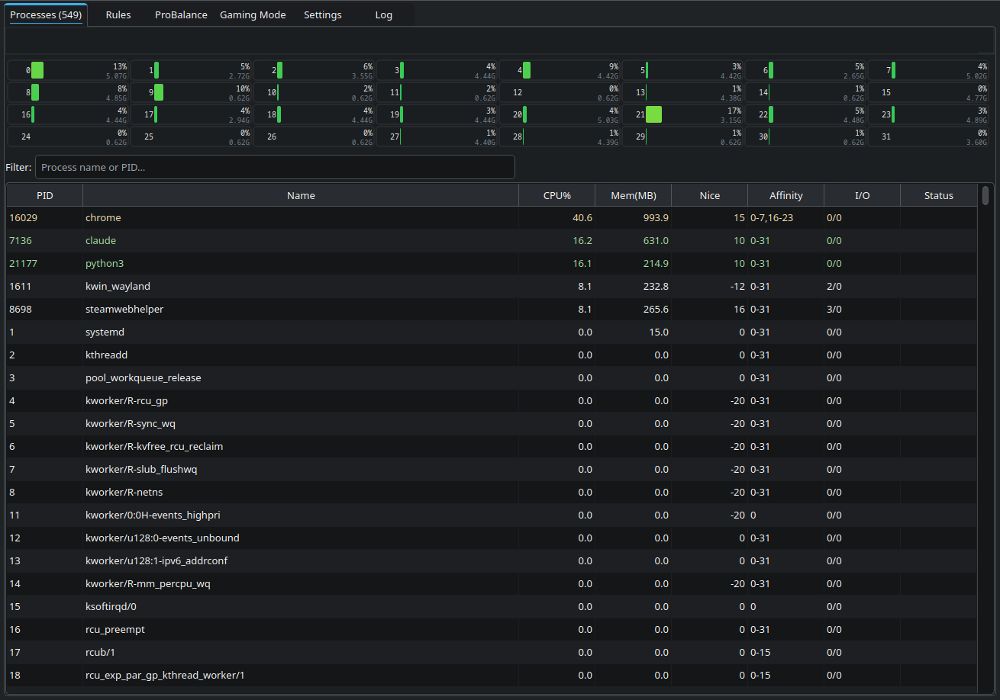
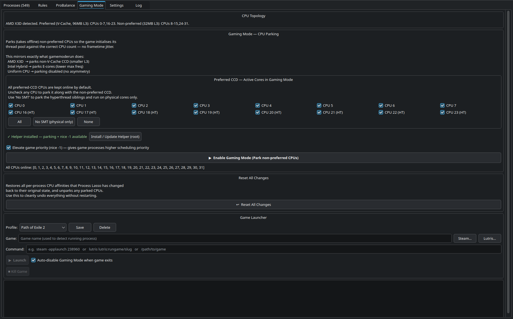
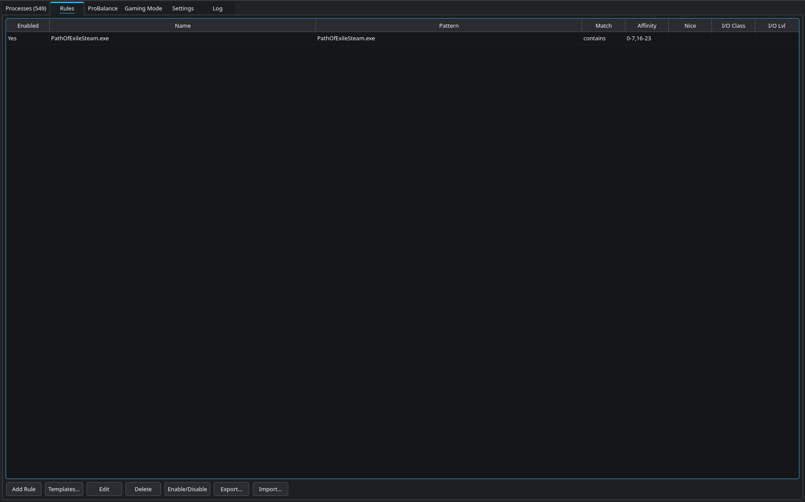
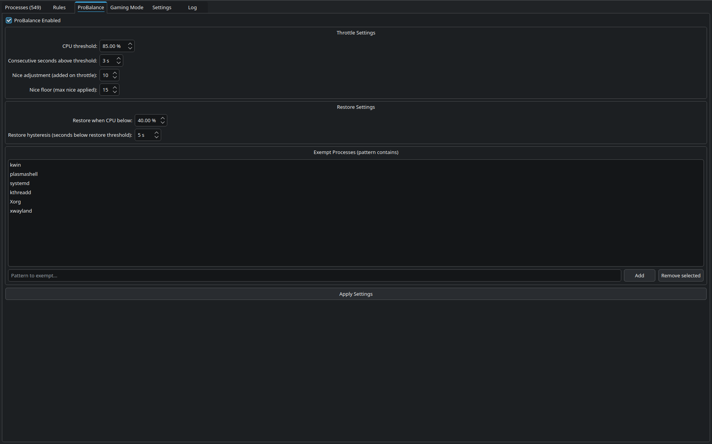
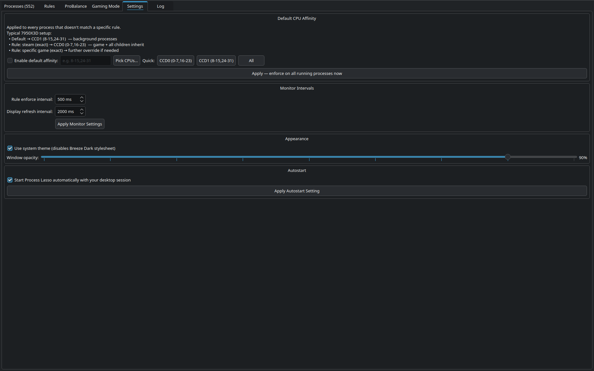
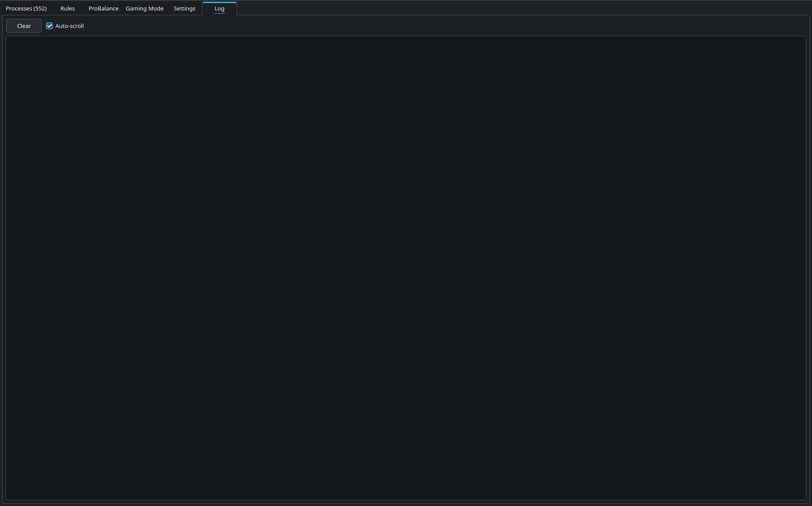

# Process Lasso for Linux — CPU affinity manager with Gaming Mode

A KDE/Linux process manager inspired by Windows Process Lasso. Built with Python + PyQt6.

## Screenshots

| Processes | Gaming Mode |
|---|---|
|  |  |

| Rules | ProBalance |
|---|---|
|  |  |

| Settings | Log |
|---|---|
|  |  |

---

## Why it beats Windows Process Lasso on X3D / Hybrid CPUs

Windows Process Lasso uses `SetThreadAffinityMask` to restrict existing threads to a subset of cores. The problem is that threads are already scheduled and thread-pool sizes are already fixed — forcing them onto fewer cores creates scheduling contention and frametime jitter that shows up as stutters in CPU-bound games.

Process Lasso for Linux uses `sysfs` CPU parking (`/sys/devices/system/cpu/cpuN/online`). Writing `0` physically removes non-preferred CPUs from the kernel scheduler **before your game ever launches**. Every process — including the game, its thread pools, and the OS itself — sees only the preferred cores from the start. Thread-pool sizing is correct, there is no competition for runqueues, and frametime variance drops measurably. This is the same technique used by `gamemoderun` on AMD X3D and Intel Hybrid platforms.

---

## Features

### Processes tab
- Live process table — sortable by CPU%, memory, PID, nice, affinity, I/O
- **Per-CPU utilization bars** — htop-style with colour ramp (green → yellow → orange → red by load)
- **CPU frequency display** — each bar shows current GHz (e.g. `4.43G`) alongside utilization %
- **Temperature tint** — bars shift orange as core temps rise (reads from hwmon/k10temp/zenpower)
- **Rolling CPU history chart** — 4-minute area graph above the bars, colour-coded by load
- Filter bar (Ctrl+F) — live search by process name or PID
- Right-click context menu: Set affinity, Set nice priority, Set I/O priority, Add rule, Kill / Force Kill
- Multi-select with Shift/Ctrl+click; Delete key to kill selected processes
- Column visibility toggle; cmdline tooltip on process name

### Rules tab
- Pin any process to specific CPU cores, permanently enforced across reboots
- Match by **name contains**, **exact name**, or **regular expression**
- **Visual CPU affinity picker** — topology-aware checkbox grid, no manual range typing required
  - Quick-select buttons: **All**, **None**, **CCD0 (V-Cache)**, **CCD1**, **CCD0 (no SMT)**
  - Pre-fills from a running process via "Select from running processes…"
- Per-rule nice priority (−20 to 19) and I/O priority (class + level)
- Enable/disable individual rules without deleting them
- Export rules to JSON / Import from JSON
- 14 built-in rule presets (Steam, Wine/Proton, OBS, Discord, browsers, compilers, etc.)

### ProBalance tab
- Automatically throttles CPU-hogging background processes when system load spikes
- Configurable CPU threshold, throttle nice value, and cooldown period
- Live count of currently throttled processes shown as a badge on the tab label
- Restore original priority the moment load drops back to normal

### Gaming Mode tab
- **One-click CPU parking** for AMD X3D and Intel Hybrid (P-core/E-core) CPUs
- Auto-detects topology: AMD X3D parks non-V-Cache CCD; Intel Hybrid parks E-cores
- Granular **preferred CCD core selector** — uncheck individual CPUs or use "No SMT" to run on physical cores only
- Elevate game priority (nice −1) for all matched processes

#### Game Launcher — supports any game source
- **Steam** — browse your installed library, auto-fills game name + launch command
- **Lutris** — reads `~/.local/share/lutris/pga.db`, auto-fills game name + command
- **Any game** — type or paste any shell command (Heroic, Bottles, native exe, etc.)
- **Auto-disable Gaming Mode** when the game exits — watches `/proc` for the game process using fuzzy name matching (handles Proton/Wine wrappers where the process name differs from the game title)
- **Kill Game** button — sends SIGTERM and restores CPUs immediately

#### Game profiles
- Save the complete game configuration as a named profile: game name, launch command, CPU parking selection, and nice preference
- **Selecting a profile instantly restores all settings** — no Load button needed
- Profile name defaults to the game name on save
- Delete profiles you no longer need

### Settings tab
- Default CPU affinity applied to all new processes
- Monitor polling interval (0.5 s – 10 s)
- Window opacity slider (20 % – 100 %)
- Toggle between custom dark theme and system Breeze Dark theme
- Start minimized to tray on launch
- Systemd user service autostart toggle (no root required)

### System tray
- Minimize to tray on window close
- Tray tooltip shows live average CPU %
- Quick Gaming Mode toggle from tray menu

---

## Requirements

- Python 3.8+
- `psutil >= 5.9`
- `PyQt6 >= 6.4`
- Linux kernel ≥ 4.1 (sysfs CPU hotplug)
- `sudo` with a NOPASSWD rule for the sysfs helper (set up via the Gaming Mode tab)

---

## Install

```bash
git clone https://github.com/FranzJeger/process-lasso-linux.git
cd process-lasso-linux
bash install.sh
```

The installer detects your package manager and prints the correct install command for any missing dependency.

## Distro compatibility

| Distro | Package manager | psutil | PyQt6 |
|---|---|---|---|
| Arch / Manjaro | pacman | `python-psutil` | `python-pyqt6` |
| Ubuntu / Debian | apt | `python3-psutil` | `python3-pyqt6` |
| Fedora / RHEL | dnf | `python3-psutil` | `python3-PyQt6` |
| openSUSE | zypper | `python3-psutil` | `python3-pyqt6` |
| Any | pip | `psutil` | `PyQt6` |

---

## Gaming Mode quick-start

### AMD X3D — multi-CCD only

Only applies to CPUs with **two CCDs where one has 3D V-Cache and the other does not**:

| CPU | Cores | 3D V-Cache CCD |
|---|---|---|
| Ryzen 9 7900X3D | 12 | CCD0 (6 cores, large L3) |
| Ryzen 9 7950X3D | 16 | CCD0 (8 cores, large L3) |
| Ryzen 9 9900X3D | 12 | CCD0 (6 cores, large L3) |
| Ryzen 9 9950X3D | 16 | CCD0 (8 cores, large L3) |

Single-CCD X3D chips (5800X3D, 7800X3D, 9800X3D) have all cores on the same die — there is nothing to park and no asymmetry to exploit.

The detector finds the CCD with the larger L3 cache and marks those cores as *preferred*. The plain CCD is parked.

1. Open Process Lasso → **Gaming Mode** tab
2. Click **Enable Gaming Mode**
3. Launch your game — it runs exclusively on the 3D V-Cache CCD
4. Click **Disable Gaming Mode** when done (cores come back online immediately)

### Intel Hybrid (12th gen+, Core Ultra)

The detector identifies P-cores (higher max frequency) as preferred and parks E-cores.

1. Open Process Lasso → **Gaming Mode** tab
2. Click **Enable Gaming Mode**
3. Launch your game — it runs on P-cores only, E-cores handle background tasks
4. Click **Disable Gaming Mode** when done

### Using the Game Launcher with profiles

1. Go to **Gaming Mode** → **Game Launcher**
2. Click **Steam…** or **Lutris…** to pick your game, or type a command directly
3. Click **Save** — a profile is created with your game name
4. Next session: select the profile from the dropdown — everything is restored instantly
5. Click **▶ Launch** — Gaming Mode enables automatically and the game starts
6. When the game exits, Gaming Mode disables automatically and all parked CPUs come back online

---

## Built with AI

This project was built entirely with [Claude](https://claude.ai) (Anthropic). Every line of Python, the GUI, the sysfs integration, the helper binary — all of it was written through a conversation with an AI assistant. No apologies. It works, it's fast, and the dark theme slaps.

If that bothers you, the unpark button is right there.

---

## License

MIT — see [LICENSE](LICENSE).
